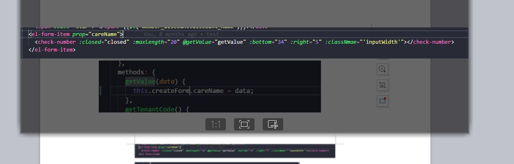

# unex-check-number
> 实现动态显示input（textarea）输入文字数量 / 最多字数,当达到最大数值时，不再输入

# 参数，方法说明
 1 closed: 根据业务需求需要，当窗口关闭会清零;
 2 maxlength： 允许输入最大字数;
 3 getValue: 需要在父组件写一个获取value的方法，传到子组件，不然会通信报错;
   
 4 bottom,right: 设置输入文字数量 / 最多字数显示位置;
 5 classNmae： 自己添加class,便于样式不满足业务需求;
 6 type: input/textarea(默认为input);